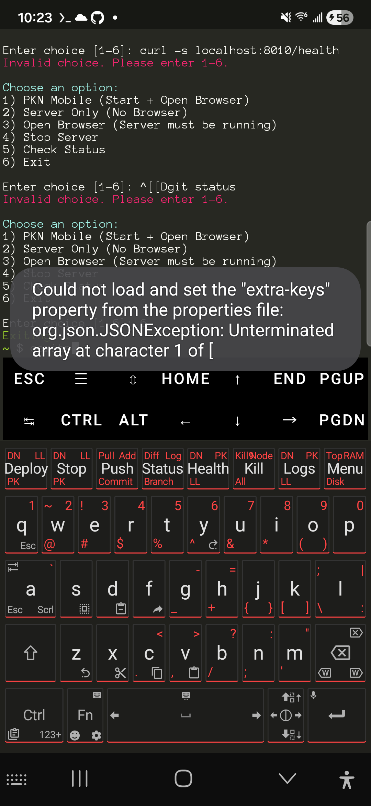

# Ghost Keys

A custom Android keyboard fork based on [Unexpected Keyboard](https://github.com/Julow/Unexpected-Keyboard), featuring a macro row for PKN/Termux workflows, custom themes, and optimized key layout.

<p align="center">
  
</p>

## Screenshot

<p align="center">
  
</p>

## Features

### Macro Row
A dedicated top row with quick-access commands for server management and development workflows:

| Key | Tap | Swipe NW | Swipe NE | Swipe SW |
|-----|-----|----------|----------|----------|
| **Deploy** | `pkn start-all` | start-divinenode | start-llama | start-parakleon |
| **Stop** | `pkn stop-all` | stop-divinenode | stop-llama | stop-parakleon |
| **Push** | `git push` | `git pull` | `git add .` | `git commit -m "` |
| **Status** | `git status` | `git diff` | `git log` | `git branch` |
| **Health** | curl :8010/health | curl :8010 | curl :9000 | curl :8000 |
| **Kill** | `pkill python` | `killall -9 python3` | `pkill node` | `pkill -f pkn` |
| **Logs** | tail divinenode.log | tail -50 DN | tail -50 PK | tail -50 LL |
| **Menu** | `pkn` | `htop` | `free -h` | `df -h` |

### PKN Color Themes
Six cyberpunk-inspired dark themes with different accent colors:

| Theme | Accent Color | Preview |
|-------|-------------|---------|
| **PKN Cyan** | `#00FFFF` | Default cyberpunk |
| **PKN Red** | `#FF4444` | Danger red |
| **PKN Purple** | `#BB86FC` | Material purple |
| **PKN Blue** | `#3399FF` | Electric blue |
| **PKN Green** | `#00FF88` | Matrix green |
| **PKN Yellow** | `#FFA500` | Warning orange |

All themes feature:
- Near-black background (`#0d0d0d`)
- Dark key backgrounds (`#1a1a1a`)
- Accent-colored bottom border glow on keys
- Accent-colored sublabels and activated states

### Optimized Layout
- **Wider 'a' and 'l' keys** (1.5x width) - eliminates wasted space in middle row
- **Extra swipe actions**: Tab/Esc on 'a', semicolon/colon on 'l'
- Full QWERTY layout with all original Unexpected Keyboard features

## Building

### Requirements
- Android SDK (API 34+)
- Java 17+
- Gradle

### Build Steps
```bash
# Clone the repo
git clone https://github.com/CovertCloak06/Ghost-Keys.git
cd Ghost-Keys

# Set Android SDK path
export ANDROID_HOME=/path/to/android-sdk

# Build debug APK
./gradlew assembleDebug

# APK will be at: build/outputs/apk/debug/Unexpected-Keyboard-debug.apk
```

### Install via ADB
```bash
adb install build/outputs/apk/debug/Unexpected-Keyboard-debug.apk
```

## Customization

### Changing Macro Commands
Edit `res/xml/macro_row.xml` to customize the macro keys:

```xml
<key key0="Label:'command\n'"
     key1="Swipe1:'other command\n'"
     key2="Swipe2:'another\n'"
     key3="Swipe3:'etc\n'"/>
```

The `\n` at the end auto-executes the command in terminal apps.

### Adding New Themes
1. Add theme style to `res/values/themes.xml`
2. Register theme in `srcs/juloo.keyboard2/Config.java` (`getThemeId` method)
3. Add to `res/values/arrays.xml` (entries and values arrays)
4. Add display name to `res/values/strings.xml`

### Changing App Name/Icon
- **App name**: Edit `res/values/strings.xml` (`app_name_release` and `app_name_debug`)
- **Icon**: Replace PNG files in `res/mipmap-*/ic_launcher.png` (sizes: 48, 72, 96, 144, 192)

## Original Features (from Unexpected Keyboard)

- Swipe-to-corner for special characters
- Multiple keyboard layouts
- Customizable key appearance
- No ads, no network requests
- Privacy-focused
- Lightweight

## Credits

- Based on [Unexpected Keyboard](https://github.com/Julow/Unexpected-Keyboard) by [Julow](https://github.com/Julow)
- Ghost Keys customizations by [@CovertCloak06](https://github.com/CovertCloak06)
- Built with assistance from Claude (Anthropic)

## License

Same license as Unexpected Keyboard - see [LICENSE](LICENSE) file.
